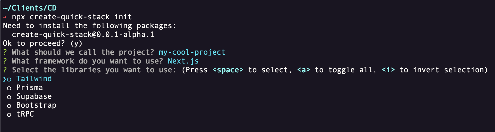

# create-quick-stack

## Overview

create-quick-stack is a command line tool designed to streamline the initial setup of JavaScript projects. This CLI tool interactively guides you to set up a new project, helping you choose the web development framework and libraries your project requires.

## Key Features

- Supports Next.js and Vue.js frameworks.
- Allows you to select and automatically installs libraries such as Tailwind, Prisma, Supabase, Bootstrap, and tRPC. (more to come!)

## Prerequisites

- Node.js and npm installed on your local machine. You can download Node.js and npm from the [official site](https://nodejs.org/).

## Installation

Install create-quick-stack globally using npm:

```bash
npm install -g create-quick-stack
```

or

Install create-quick-stack globally using yarn:

```bash
yarn global add create-quick-stack
```

## Usage

To start setting up a new project, use the command:

```bash
npx create-quick-stack init
```

The CLI will then guide you through the setup process. You will be asked to enter a name for your project and to select your preferred framework and libraries like so:



## Contributing

Pull requests are welcome. For major changes, please open an issue first to discuss what you would like to change.

## License

[MIT](https://choosealicense.com/licenses/mit/)

Please note that this project is released with a Contributor Code of Conduct. By participating in this project you agree to abide by its terms.
